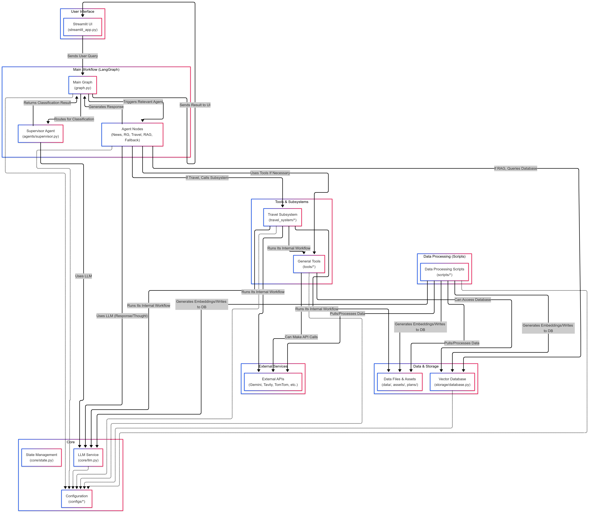

# Agentic AI Chatbot Project

This project is a **supervisor-based multi-agent** AI chatbot designed to answer user queries on various topics. The system is built around a supervisor agent that analyzes incoming queries and routes them to the most suitable specialized agent for the task.

## Key Capabilities

* **Supervisor Routing:** Classifies the user query topic (e.g., Resmi Gazete, News/General Knowledge, Travel Planning, Uploaded Document Query, Other) and triggers the relevant agent.
* **Resmi Gazete Querying (RAG):** Generates responses using RAG (Retrieval-Augmented Generation) on Turkish Resmi Gazete documents via a Vector Database (ChromaDB).
* **News and General Knowledge:** Includes a ReAct agent using web search (Tavily/DuckDuckGo) and Wikipedia tools for current events, definitions, and general knowledge questions.
* **Travel Planning:** Runs a complex sub-workflow (containing its own agents and tools) to generate detailed travel plans based on user-provided destination, dates, budget, etc., and can present the result as a PDF.
* **Agentic RAG (Document Querying):** Allows users to upload their own documents (PDF, TXT, DOCX, etc.) and ask questions about their content. This agent processes the uploaded document and generates answers using the RAG mechanism.
* **Fallback:** Provides a standard response for queries outside the defined scopes.

## Deficiencies
* Agent Memory
  
## Technologies Used

* **Programming Language:** Python
* **Orchestration & Agent Framework:** LangChain & LangGraph
* **User Interface:** Streamlit
* **Language Model (LLM):** Google Gemini (e.g., Gemini 1.5 Flash)
* **Embedding Models:** intfloat/multilingual-e5-large (classic RAG) & models/embedding-001 (Agentic RAG) 
* **Vector Database:** ChromaDB
* **External APIs:** Tavily/DuckDuckGo, Wikipedia, Google Serper, OpenWeatherMap, TomTom Maps, ExchangeRate-API
* **Containerization:** Docker & Docker Compose

This system aims to provide users with a comprehensive chat experience by integrating different information sources and capabilities under a single interface.

#### Running chatbot in local environment
* Extract the agentic-chatbot-project folder inside the .zip and make sure you are inside the folder.
0. `git clone https://github.com/Shubham-murar/supervisor-multi-agent`
1. `python -m venv .venv` 
2. `.venv\Scripts\activate`
3. `pip install -r requirements.txt` 
   
* Please make sure that you set the API keys correctly in [env file](.env).
* The documentation and embeddings provided for the chatbot are located in the [data](./data/) folder. If it is necessary or desirable to re-extract, process and create embeddings of the data, you can continue from **step 4**. Otherwise, you can continue from step **9**.
4. `python scripts/del.py`   
5. `python scripts/news_fetcher.py`
6. `python scripts/resmi_news_fetcher.py`
7. `python scripts/process_data.py`
8. `python scripts/generate_embeddings.py`
9. `streamlit run app/ui/streamlit_app.py --server.fileWatcherType none`

* Open your browser and go to [address](http://localhost:8501). The application may take some time to install (mainly due to the model download on the first run).

------------

#### Running the project with Docker
* Extract the agentic-chatbot-project folder inside the .zip and make sure you are inside the folder.
* Make sure the data is in the [data](./data/) folder.
1. `docker compose build`
2. `docker compose up` 

* Open your browser and go to [address](http://localhost:8501). The application may take some time to load (especially due to the model download on the first run).

------------

## Usage

When the application interface opens [on localhost](http://localhost:8501):

1. Type your question in the text input field at the bottom of the page.
2. Press the Send (Enter) key.
3. You can see the answer of the chatbot and the source of the answer (Resmi Gazete RAG, News Agent, Fallback).
4. For Resmi Gazete answers, click on "Details: Context Used (RAG)" for Resmi Gazete answers to see which texts LLM used.
5. You can upload a document for only Agentic RAG Agent and get answers to your questions.
6. Travel plans can also be created, specifying an appropriate budget, destination and length of stay; and you can get the plan as a PDF.
7. You can delete the conversation history with the “Clear Chat” button in the sidebar.

------------

## Chatbot Architecture



## Project Structure
```
agentic-chatbot-project/
├── app/                      # Main application code
│   ├── agents/               # Core agent logic used as nodes in LangGraph
│   │   ├── __init__.py
│   │   ├── agentic_rag_agent.py   # Agent performing RAG with uploaded documents (LangGraph node)
│   │   ├── fallback_agent.py       # Agent for cases not fitting other categories (LangGraph node)
│   │   ├── news_agent.py           # Agent for general information/news queries (LangGraph node)
│   │   ├── resmi_gazete_agent.py   # Resmi Gazete RAG agent (LangGraph node) - renamed from resmi_news_agent.py
│   │   ├── supervisor.py           # Agent that classifies and routes the query (LangGraph node)
│   │   └── travel_agent.py         # Agent processing travel queries (LangGraph node), calls TravelPlanningSystem
│   ├── core/                   # Core components (LLM, State)
│   │   ├── __init__.py
│   │   ├── llm.py               # Manages LLM instances (get_llm)
│   │   └── state.py             # Main AgentState definition (for LangGraph)
│   ├── storage/                # Data storage related (ChromaDB)
│   │   ├── __init__.py
│   │   └── database.py          # ChromaDB client, collection management, querying
│   ├── tools/                  # General tools used by main agents
│   │   ├── __init__.py
│   │   ├── external_apis.py     # Tools for Wikipedia, WebSearch (Tavily/DDG) (used by news_agent)
│   │   └── rag_tools.py         # retrieve_documents, format_context (used by resmi_gazete_agent)
│   ├── travel_system/          # Travel planning subsystem (its own workflow)
│   │   ├── __init__.py
│   │   ├── agents/             # Specialized agents within the travel system
│   │   │   ├── __init__.py
│   │   │   ├── coordinator_agent.py  # Agent compiling the travel plan
│   │   │   ├── date_budget_agent.py   # Agent processing dates and budget
│   │   │   └── destination_agent.py   # Agent researching destination info (city, weather, hotel links)
│   │   ├── tools/              # Tools specific to the travel system
│   │   │   ├── __init__.py
│   │   │   ├── budget_tools.py      # Currency rates, budget evaluation
│   │   │   ├── date_tools.py        # Date calculations
│   │   │   ├── destination_tools.py # City info, weather, hotel links, map URLs
│   │   │   └── parsing_tools.py     # Structuring the user query
│   │   ├── utils/              # Utility modules for the travel system
│   │   │   ├── __init__.py
│   │   │   └── pdf_saver.py        # Saving travel plan as PDF
│   │   └── workflow.py         # TravelPlanningSystem class (LangGraph workflow for travel)
│   ├── ui/                     # Streamlit user interface
│   │   ├── __init__.py
│   │   └── streamlit_app.py    # Main Streamlit app, calls graph.py
│   ├── utils/                  # General helper functions (embedding, text processing)
│   │   ├── __init__.py
│   │   ├── embedding.py         # Loading embedding model and creating embeddings (used by scripts and database)
│   │   └── text_processing.py   # Text splitting (used by process_data script)
│   ├── __init__.py
│   └── graph.py                # Main LangGraph workflow (AgentState, Supervisor, Agent Nodes)
├── assets/                   # Static files (e.g. fonts)
│   └── fonts/                # Font files for PDF generation
│       ├── DejaVuSansCondensed.ttf
│       └── DejaVuSansCondensed-Bold.ttf
├── configs/                  # Configuration files
│   ├── __init__.py
│   ├── agent_config.py       # Prompts for agents, categories, RAG settings, etc.
│   ├── api_config.py         # Logic for loading API keys (e.g. load_dotenv)
│   ├── app_config.py         # General settings for app/ (Chroma path, model names, etc.)
│   └── script_config.py      # Settings for scripts/ (URLs, paths, etc.)
├── data/                     # Application data (can be volume-mounted)
│   ├── embeddings/           # ChromaDB database files
│   │   └── chroma.sqlite3    # (and other ChromaDB files)
│   ├── processed/            # Processed and chunked data (.jsonl)
│   │   ├── haberler/          # News
│   │   │   └── haberler_processed.jsonl
│   │   └── resmi_gazete/      # Resmi Gazete
│   │       └── resmi_gazete_processed.jsonl
│   └── raw/                  # Raw fetched data
│       ├── haberler/          # News
│       │   └── trt_haberler.json
│       └── resmi_gazete/      # Resmi Gazete
│           └── aa_resmi_gazete_tum_haberler.json
├── plans/                    # Directory for saved travel plan PDFs
├── scripts/                  # Data processing and preparation scripts
│   ├── __init__.py
│   ├── del.py                # Optional script to clean the data/ directory
│   ├── generate_embeddings.py# Generates embeddings from processed data and writes to DB
│   ├── news_fetcher.py       # Fetches data from TRT Haber RSS
│   ├── process_data.py       # Processes raw data, splits into chunks
│   └── resmi_news_fetcher.py # Fetches Resmi Gazete news from AA
├── .dockerignore             # Files to ignore in Docker build
├── .env                      # Environment variables (API keys, etc.) – should not be committed!
├── .gitignore                # Files not tracked by Git
├── chatbot-architecture.png  # Generated Mermaid architecture diagram
├── docker-compose.yml        # Docker Compose configuration
├── Dockerfile                # Dockerfile for main application
├── README.md                 # Project description
└── requirements.txt          # Python dependencies

 
```
------------
